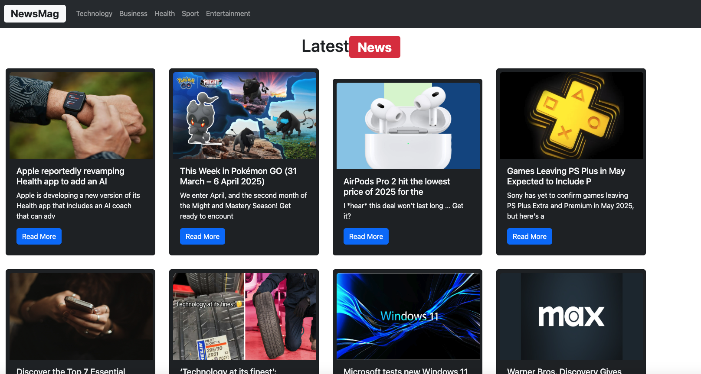

# NewsMag 

## Simple React Project using useState and useEffect hooks  and external news api

## Development 
1. go to here https://newsapi.org/ and create account and get apikey
2. create .env file and put VITE_API_KEY=newapikey
3. development

``npm install ``\
 ``npm run dev``
